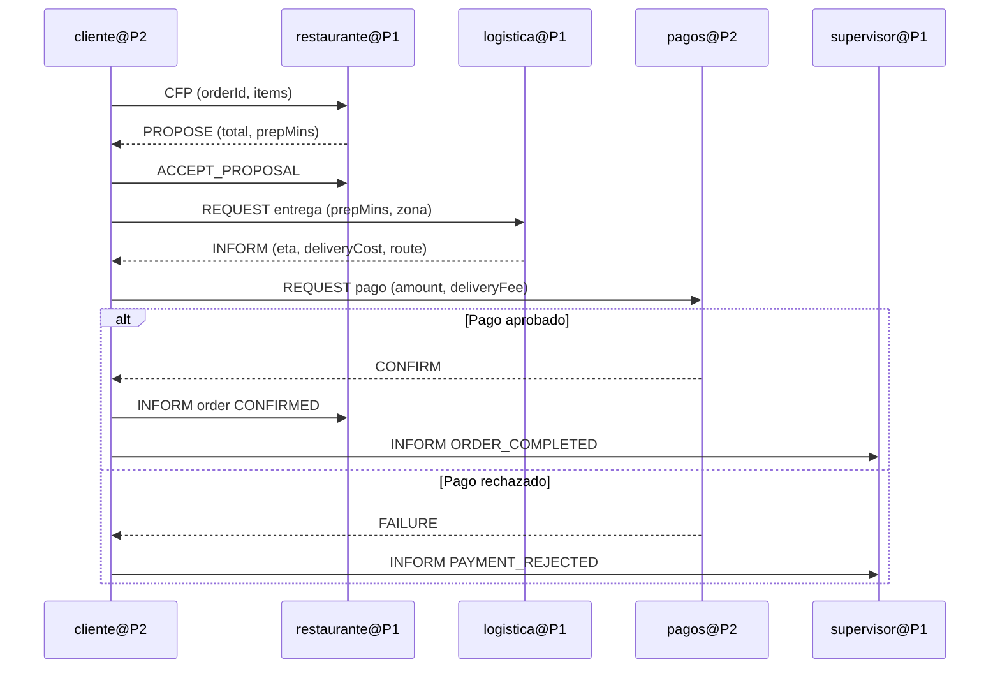

# CARÁTULA

**Curso:** `<<NOMBRE_DEL_CURSO>>`

**Docente:** `<<NOMBRE_DEL_DOCENTE>>`

**Título del trabajo:** *Implementación de un Sistema Multi-Agente Distribuido con JADE para Gestión Colaborativa de Pedidos de Restaurantes*

**Integrantes:**

- `<<INTEGRANTE_1>>`
- `<<INTEGRANTE_2>>`
- `<<INTEGRANTE_3>>`
- `<<INTEGRANTE_4>>`

**Repositorio GitHub:** [<<URL_GITHUB_REPO>>](<<URL_GITHUB_REPO>>)

**Video YouTube:** [<<URL_YOUTUBE_VIDEO>>](<<URL_YOUTUBE_VIDEO>>)

**Fecha:** 18 de abril de 2026

---

# 1. Introducción

Los sistemas multi-agente constituyen una aproximación robusta para resolver problemas distribuidos, especialmente en escenarios donde múltiples entidades autónomas deben coordinarse en tiempo real. En este trabajo se presenta el diseño e implementación de un sistema distribuido con JADE (Java Agent DEvelopment Framework), desplegado sobre dos plataformas independientes conectadas por red.

La propuesta modela un proceso de gestión de pedidos en una cadena de restaurantes. Se utilizan mecanismos de descubrimiento de servicios mediante el Directory Facilitator (DF), protocolos de interacción basados en FIPA-ACL y una arquitectura distribuida ejecutada en contenedores Docker. El objetivo central es evidenciar colaboración real entre agentes, intercambio de información útil y generación de resultados integrados en un entorno heterogéneo.

# 2. Objetivos

## 2.1 Objetivo general

Implementar un sistema multi-agente distribuido en JADE, compuesto por al menos dos plataformas y cinco agentes cooperativos, que resuelva colaborativamente el flujo de un pedido de restaurante mediante comunicación FIPA-ACL y descubrimiento de servicios en DF.

## 2.2 Objetivos específicos

1. Diseñar una arquitectura distribuida de dos plataformas JADE (P1 y P2) comunicadas por red.
2. Implementar agentes con responsabilidades diferenciadas y lógica de negocio autónoma.
3. Registrar y descubrir servicios dinámicamente mediante Directory Facilitator.
4. Integrar performativas ACL (`CFP`, `PROPOSE`, `REQUEST`, `INFORM`, `CONFIRM`, `FAILURE`) en el flujo de colaboración.
5. Validar la ejecución en Docker y documentar resultados con evidencia técnica.

# 3. Descripción de la propuesta de solución

## 3.1 Problema abordado

Se requiere coordinar actores distribuidos para gestionar un pedido completo: cotización, planificación de entrega, validación de pago y supervisión global del proceso, evitando acoplamiento rígido entre componentes.

## 3.2 Propuesta implementada

Se implementó un SMA distribuido para gestión de pedidos:

- **Plataforma P1**
  - `restaurante@P1`: genera oferta de menú (precio + tiempo de preparación).
  - `logistica@P1`: calcula ruta, costo y tiempo estimado de entrega.
  - `supervisor@P1`: monitorea mensajes y genera reporte periódico.
- **Plataforma P2**
  - `cliente@P2`: inicia y coordina el ciclo de pedido.
  - `pagos@P2`: valida transacción de pago y responde aprobación/rechazo.

El agente `cliente@P2` consume resultados producidos por otros agentes y los encadena para tomar decisiones, demostrando colaboración real multi-etapa.

# 4. Contenido adicional

## 4.1 Arquitectura del sistema (Mermaid)

```mermaid
flowchart LR
    subgraph P1[Platform 1 - JADE]
      MC1[Main Container P1]
      C11[Container 1 P1\nlogistica@P1]
      C12[Container 2 P1\nsupervisor@P1]
      R[restaurante@P1]
      DF1[(DF P1)]
      MC1 --- R
      MC1 --- C11
      MC1 --- C12
      R --- DF1
      C11 --- DF1
      C12 --- DF1
    end

    subgraph P2[Platform 2 - JADE]
      MC2[Main Container P2]
      C21[Container 1 P2\ncliente@P2]
      P[pagos@P2]
      DF2[(DF P2)]
      MC2 --- P
      MC2 --- C21
      P --- DF2
      C21 --- DF2
    end

    C21 -- CFP/PROPOSE/INFORM --> R
    C21 -- REQUEST/INFORM --> C11
    C21 -- REQUEST/CONFIRM --> P
    C21 -- INFORM --> C12
    P1 <-. red Docker + MTP HTTP .-> P2
```

## 4.2 Diagrama de flujo de interacción



## 4.3 Requerimientos técnicos

- Java 17+
- Maven 3.9+
- JADE 4.5.0
- Docker Desktop y Docker Compose
- Red bridge para interconexión entre contenedores
- Exposición de MTP HTTP por plataforma:
  - P1: `http://p1-main:7778/acc`
  - P2: `http://p2-main:8888/acc`

## 4.4 Prototipo implementado

El prototipo se construyó como proyecto Maven modular, con paquetes separados para agentes, comportamientos y utilidades comunes. Se utilizaron comportamientos `CyclicBehaviour`, `OneShotBehaviour` y protocolo `ContractNetResponder/ContractNetInitiator`.

## 4.5 Evidencias (capturas de pantalla)

> Sustituir los placeholders por capturas reales del entorno de ejecución.

1. **Captura 1 - GUI JADE P1 (Main + Containers):**
   - Archivo sugerido: `docs/capturas/01-gui-p1.png`
   - Debe mostrar `restaurante@P1`, `logistica@P1`, `supervisor@P1`.

2. **Captura 2 - GUI JADE P2 (Main + Container):**
   - Archivo sugerido: `docs/capturas/02-gui-p2.png`
   - Debe mostrar `cliente@P2` y `pagos@P2`.

3. **Captura 3 - Registro en DF:**
   - Archivo sugerido: `docs/capturas/03-df-servicios.png`
   - Debe mostrar servicios registrados por cada agente.

4. **Captura 4 - Mensajes ACL en consola:**
   - Archivo sugerido: `docs/capturas/04-mensajes-acl.png`
   - Debe mostrar `CFP`, `PROPOSE`, `REQUEST`, `INFORM`, `CONFIRM/FAILURE`.

5. **Captura 5 - Docker Compose en ejecución:**
   - Archivo sugerido: `docs/capturas/05-docker-compose-up.png`
   - Debe mostrar los 5 contenedores activos.

## 4.6 Configuración Docker / VM

Se seleccionó Docker por eficiencia de despliegue, portabilidad y facilidad de réplica. La configuración implementada contiene cinco servicios:

- `p1-main`
- `p1-c1`
- `p1-c2`
- `p2-main`
- `p2-c1`

Se empleó una red bridge compartida (`sma-net`) y comandos JADE específicos (`-name`, `-container`, `-host`, `-port`, `-mtp`) para establecer las dos plataformas distribuidas.

## 4.7 Validación de ejecución (evidencia técnica)

Durante la validación final se confirmó la ejecución completa del sistema con los siguientes resultados observables:

- Construcción exitosa de imágenes (`docker compose build`).
- Levantamiento de los 5 contenedores (`docker compose up -d --build`).
- Registro de todos los agentes en DF.
- Intercambio colaborativo de mensajes ACL entre plataformas.
- Confirmación de pedidos completos con auditoría del supervisor.

Comandos utilizados para verificar el estado del entorno:

```powershell
docker compose ps
docker compose logs --tail=200 p2-c1 p1-main p1-c1 p2-main p1-c2
```

Para facilitar la recopilación visual del informe, se preparó la guía:

- `docs/checklist-capturas.md`

## 4.8 Ejemplos de mensajes ACL intercambiados

### Ejemplo A: Solicitud de cotización (Contract Net)

- **Emisor:** `cliente@P2`
- **Receptor:** `restaurante@P1`
- **Performativa:** `CFP`
- **Contenido:** `orderId=ORD-171...;items=3;requestedAt=...`

### Ejemplo B: Propuesta de restaurante

- **Emisor:** `restaurante@P1`
- **Receptor:** `cliente@P2`
- **Performativa:** `PROPOSE`
- **Contenido:** `orderId=...;restaurant=restaurante;total=27.5;prepMins=18`

### Ejemplo C: Solicitud logística

- **Emisor:** `cliente@P2`
- **Receptor:** `logistica@P1`
- **Performativa:** `REQUEST`
- **Contenido:** `orderId=...;prepMins=18;zone=Sector-Centro`

### Ejemplo D: Confirmación de pago

- **Emisor:** `pagos@P2`
- **Receptor:** `cliente@P2`
- **Performativa:** `CONFIRM`
- **Contenido:** `orderId=...;approved=true;totalCharged=31.42`

### Ejemplo E: Notificación al supervisor

- **Emisor:** `cliente@P2`
- **Receptor:** `supervisor@P1`
- **Performativa:** `INFORM`
- **Contenido:** `orderId=...;status=ORDER_COMPLETED;agent=cliente`

# 5. Conclusiones

1. El uso de JADE permitió implementar coordinación distribuida con separación clara de responsabilidades por agente.
2. El Directory Facilitator resultó fundamental para reducir acoplamiento y habilitar descubrimiento dinámico de servicios.
3. El protocolo ACL facilitó trazabilidad de interacciones y semántica explícita entre participantes.
4. El despliegue en Docker simplificó la reproducción del entorno distribuido con dos plataformas y múltiples contenedores.
5. La propuesta demuestra colaboración efectiva: cada etapa depende de resultados previos generados por otros agentes.

# 6. Referencias

1. Bellifemine, F., Caire, G., & Greenwood, D. (2007). *Developing Multi-Agent Systems with JADE*. Wiley.
2. Foundation for Intelligent Physical Agents (FIPA). (2002). *ACL Message Structure Specification*.
3. JADE Official Documentation. [https://jade.tilab.com](https://jade.tilab.com)
4. Apache Maven Project. [https://maven.apache.org](https://maven.apache.org)
5. Docker Documentation. [https://docs.docker.com](https://docs.docker.com)
