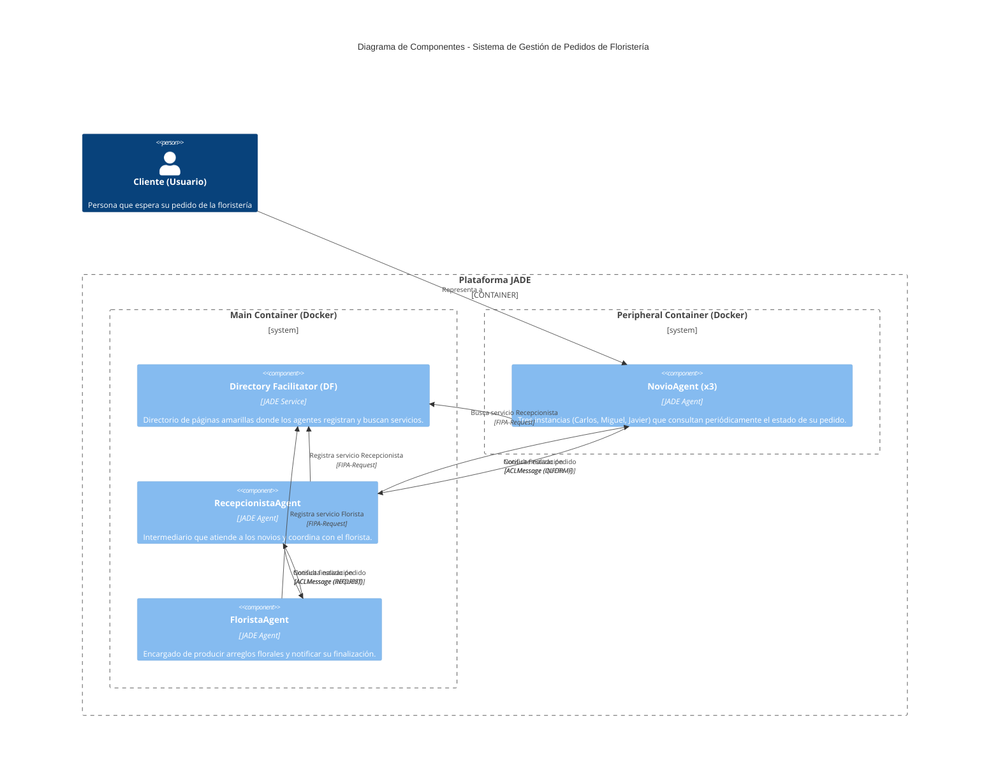

# Arquitectura de Sistema

Este documento describe la arquitectura a nivel de componentes del Sistema Multi-Agente de Gestión de Pedidos de Floristería, basado en JADE (Java Agent Development Framework).

## Diagrama de Componentes (C4 Model - Nivel 2)

El siguiente diagrama muestra los componentes principales del sistema, los contenedores y cómo interactúan entre sí.

## Infraestructura y Dependencias Externas

### Infraestructura
El sistema está diseñado para ejecutarse en un entorno distribuido simulado utilizando contenedores de Docker. Se divide en dos contenedores principales:
*   **Main Container:** Aloja la plataforma principal de JADE, el Directory Facilitator (DF) y los agentes proveedores de servicios (`RecepcionistaAgent` y `FloristaAgent`).
*   **Peripheral Container:** Aloja a los agentes clientes (`NovioAgent`). Se conecta a la plataforma principal para interactuar con los servicios.

### Dependencias Externas Clave
1.  **JADE (Java Agent Development Framework):** Es el *framework* central del proyecto. Proporciona la infraestructura subyacente para el ciclo de vida de los agentes, el enrutamiento de mensajes, las ontologías (aunque aquí se usan cadenas de texto simples en el contenido del mensaje) y el Directory Facilitator. En este proyecto se utiliza incluyéndolo como una dependencia del sistema (`jade.jar`).
2.  **Java (JDK 17):** Entorno de ejecución y lenguaje de programación base.
3.  **Maven:** Herramienta de gestión de dependencias y construcción del ciclo de vida del proyecto.
4.  **Docker & Docker Compose:** Utilizados para contenerizar la aplicación y orquestar el entorno de despliegue de múltiples contenedores de manera sencilla y reproducible, abstrayendo las configuraciones de red de JADE.
