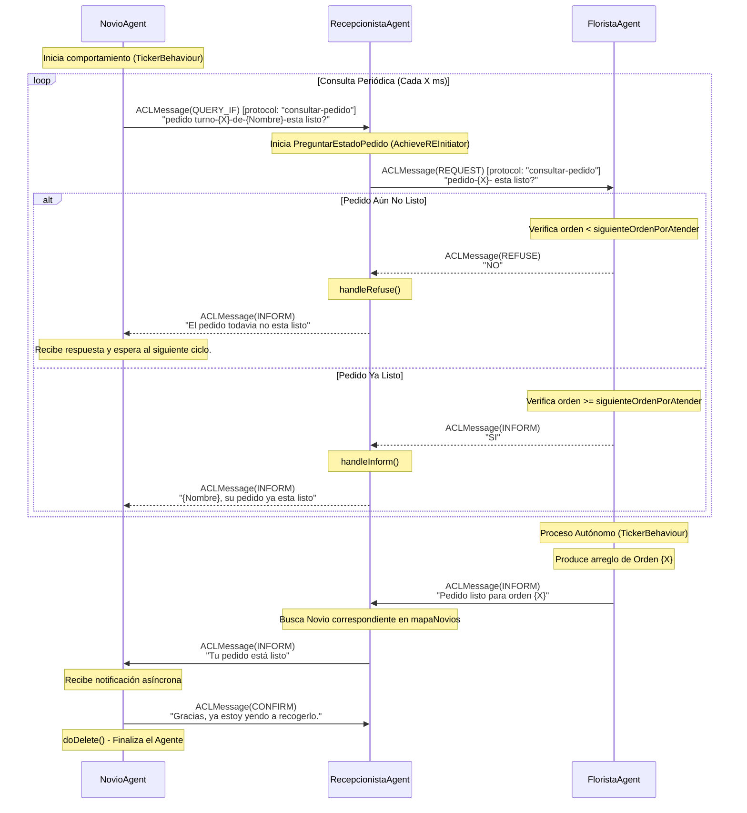
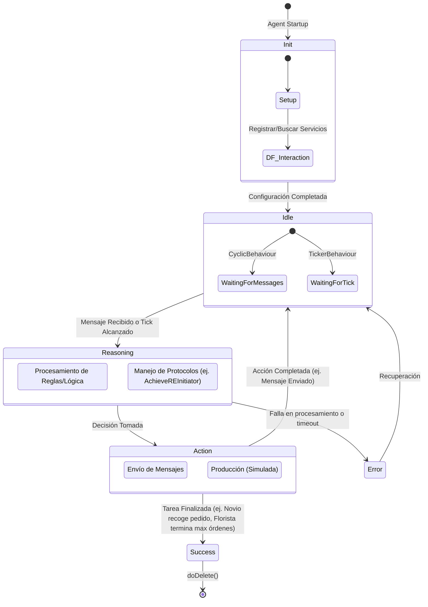
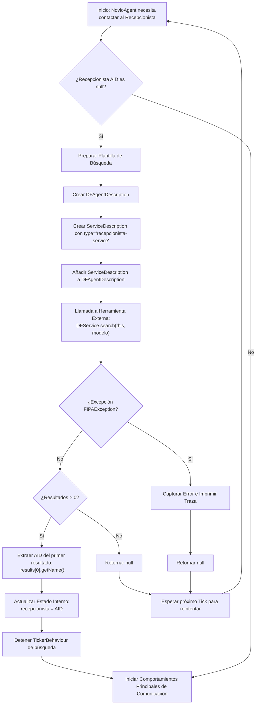

# Lógica de Agentes

Este documento detalla la interacción, los estados y el uso de herramientas (como la búsqueda en el Directory Facilitator) por parte de los agentes del sistema.

## Diagrama de Secuencia de Interacción

El siguiente diagrama ilustra cómo los agentes se comunican entre sí utilizando mensajes FIPA-ACL para coordinar el estado de un pedido.

## Máquina de Estados de los Agentes

Aunque JADE se basa en comportamientos (`Behaviours`) que se planifican cooperativamente, podemos modelar el ciclo de vida de los agentes mapeándolo a una máquina de estados general de un sistema basado en agentes.

## Flujo de Herramientas (Tool Use): Interacción con el Directory Facilitator (DF)

En este sistema, la principal "herramienta" que utilizan los agentes es el servicio de Páginas Amarillas proporcionado por el Directory Facilitator (DF) de JADE. Este diagrama explica el flujo de cómo un agente consulta el DF para encontrar a otro agente con el que necesita comunicarse.

