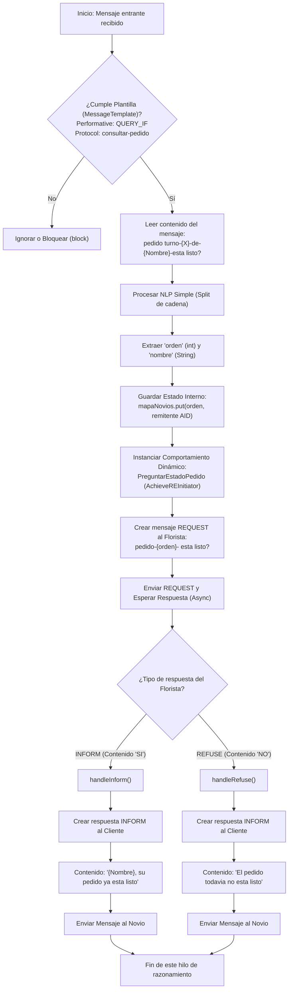
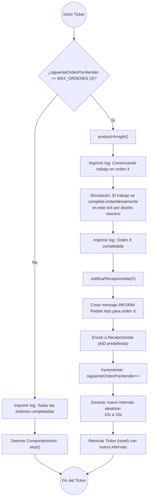
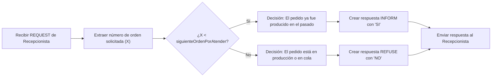

# Flujos de Trabajo (Workflows)

Este documento detalla los flujos de trabajo críticos de los agentes, desglosando la lógica interna de toma de decisiones y procesamiento.

## Flujo de Razonamiento del Agente Recepcionista

El `RecepcionistaAgent` actúa como un orquestador o *proxy* entre los clientes (`NovioAgent`) y el productor (`FloristaAgent`). El flujo principal de razonamiento ocurre cuando recibe una consulta de un cliente.

## Flujo de Producción y Sincronización del Agente Florista

El `FloristaAgent` posee un flujo de trabajo concurrente. Por un lado, mantiene un proceso autónomo de "fabricación" simulada. Por otro, responde proactivamente a las interrupciones del Recepcionista basándose en el estado de su fabricación.

### Flujo de Producción Autónoma (TickerBehaviour)

Este es el pipeline principal de trabajo en segundo plano.

### Flujo de Evaluación de Estado (Respuesta a REQUEST)

Cuando el Florista recibe una interrupción (REQUEST) del Recepcionista, no detiene su producción. Simplemente evalúa su estado actual y responde.

